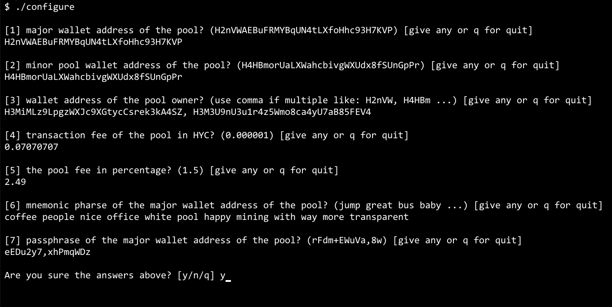

## FreeHycon source 
Please refer to [FreeHycon](https://github.com/freeolpark/docker.git) to look around `FreeHycon` project
## Installation of FreeHycon Mining Pool

```bash
## clone the repository
$ git clone https://github.com/freeolpark/docker.git
$ tree docker
docker/
├── Dockerfile
├── README.md
├── build.sh
├── config.ts
├── config_example.png
├── configure
├── peerdbsql
├── run.sh
└── start.sh

## configure with your own parameter
## refer to an example below how to do this: 
$ cd docker 
$ ./configure 


## build directly a docker image for freehycon mining pool solution.
## it will take 5-10 mins.
$ ./build.sh

## then you can find the "freehycon" docker image here.
$ docker images

## run all the mining pool solution at once
$ ./start.sh --all 

## or run separately if needed
$ ./start.sh --main
$ ./start.sh --sub
$ ./start.sh --stratum
```


#### Example of running ./configure


